## Unity physics system

You might hear the word "physics" thrown around a lot in game development, so let's go over what physics means in Unity. In the real world, objects are affected by gravity, friction, collisions, weight etc. Likewise in a game! Objects are also affected by the forces of physics. 

To implement real-world behaviors in a game, there are two **physics engines** that Unity uses:

- **NVIDIA PhysX** implements 3D physics.

- **BOX2D** implements 2D physics.

Additionally there are two sets of **components** that are used to handle physics in games:

- **3D physics components** including Rigidbody, Box Collider, Capsule Collider, Sprint Joint and Fixed Joint are used in 3D games. 

- **2D physics components** including Rigidbody2D, Box Collider 2D, Capsule Collider 2D, Sprint Joint 2D and Fixed Joint 2D are used in 2D games.

There are also two modules for **scripting** physics-based behavior:

- **Physics module** has classes, enumerations, structures etc for handling 3D physics.

- **Physics 2D module** has classes, enumerations, structures etc for handling 2D physics.

## Rigidbody

A Rigidbody in Unity is a component which when added to any GameObject **allows it to interact with fundamental physics behavior**, for example forces such as gravity and acceleration. A GameObject that has a Rigidbody component will be treated as a real-world object in the physical world - affected by gravity, acceleration and mass.

Suppose you have a cube object in your game which you want to act like a real-world object, following the law of gravity, having mass and feeling heavy when it is pushed and pulled.

In your scene make a 3D Plane and then a 3D Cube which will be placed on top of the plane:

[comment]: <GM: NOTE my 3D plane does not look 3D like yours. Scaling teh y axis does not give it any height>
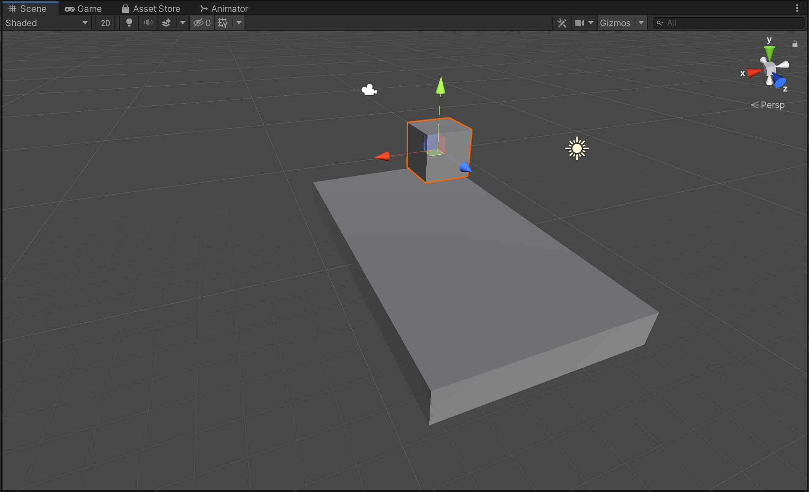

Now let's add the Rigidbody component to the cube. Select the cube and then in the _inspector window_ click on `Add Component > Physics > Rigidbody`

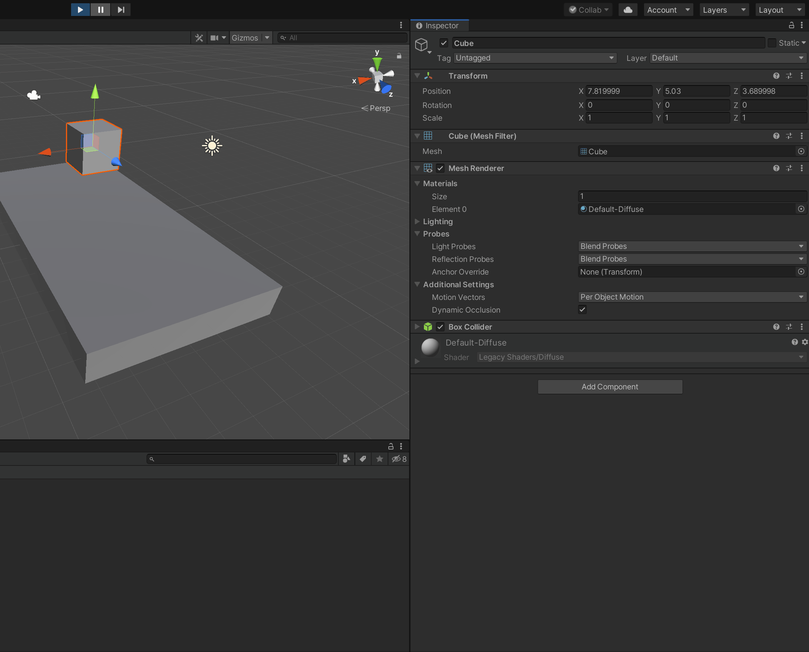

Ok - great. Now go to the game window and click on the _play_ button and see this in action. You see that the cube is affected by gravity and falls down on the plane.

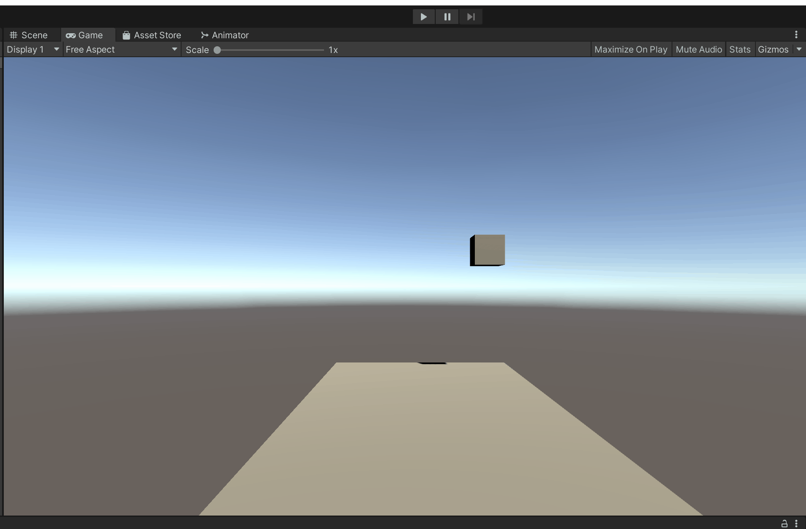

The Physics Manager contains the settings for physics properties such as gravity. To check this go to `Edit > Project Settings > Physics`.

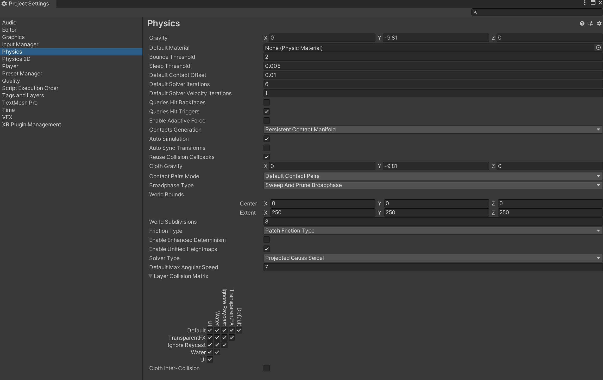

Here you can see the settings for properties such as gravity, which is `- 9.81 m/s` along the `Y` axis.

## Properties of rigid bodies

The properties of rigid bodies can be changed in the Rigidbody component in the _inspector window_. 

### Mass
This is the mass of an object in kgs. Mass is similar to weight and affects how much the object moves when other forces like gravity or collisions act on it. The bigger the mass, the less the object is affected.

[comment]: <GM: can I check you are not expecting readers to actually do these next steps? It's not quite clear but you don't explain how to create the seesaw Addressed:  yes its just a demo>
When both cubes are of the same weight (eg 1kg each), they fall down and the plank does not sway either way:

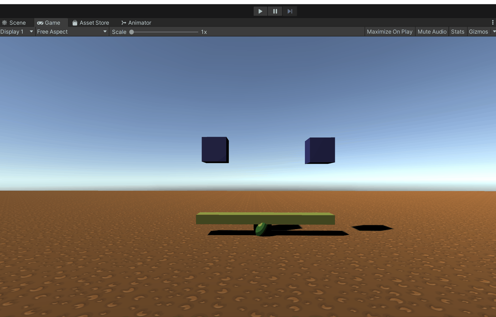

However, when the right cube weighs more (5kg) than the left cube (1kg), the plank will sway more to the right as it has more weight on that side:

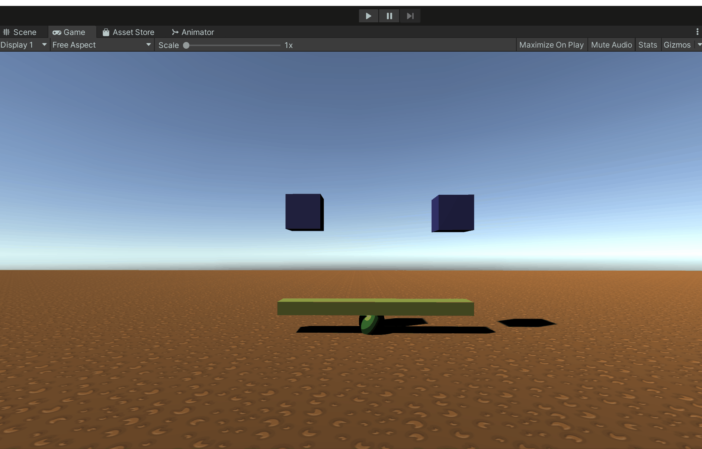

### Drag

This is resistance to **linear velocity** and it is used to slow down the motion of an object. So an object's fall or movement will slow by increasing the drag. At **0** drag, objects fall at `-9.81 m/s.`

I'm going to increase the drag to **20** for both cubes and see how they move:

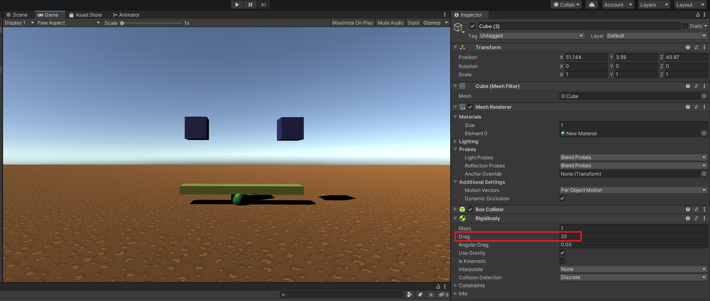

### Angular drag
This is resistance to **angular velocity** and it is used to slow down the rotation of an object. Increasing the angular drag will slow the rotation of an object, whereas decreasing it will make the object rotate faster.

What happens when we increase the angular drag of the plank to **20**?

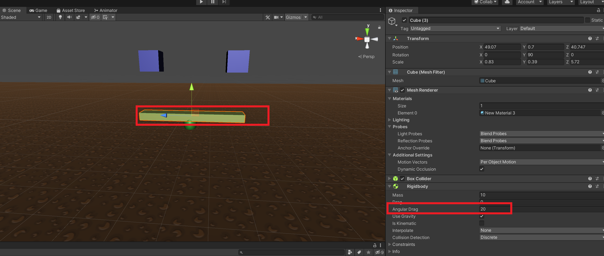

It slows the rotation of the plank:

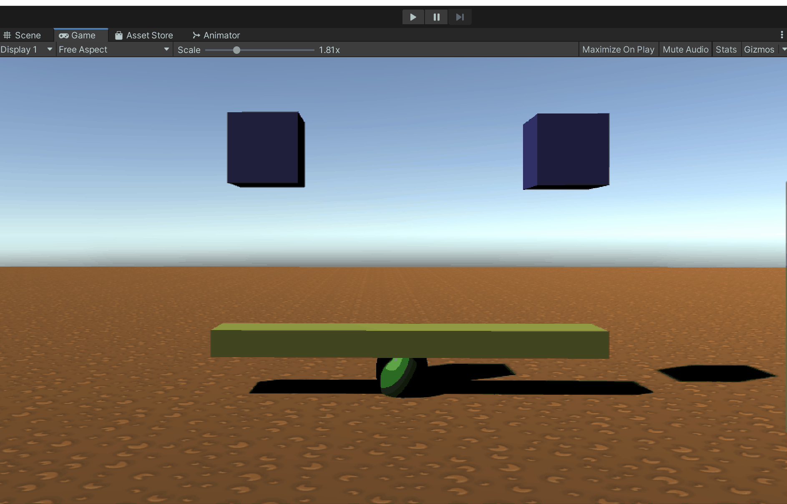

Similarly, I'm going to increase the angular drag of the right cube which has a mass of 5kg to **20**, and we see that ceases rotation of the cube:

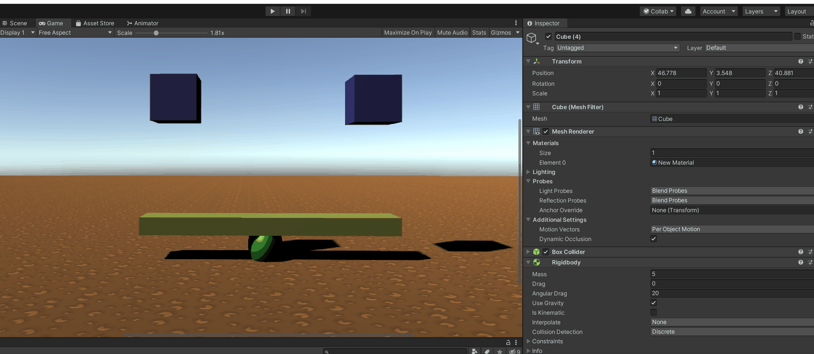

### Use gravity 

This property indicates whether the game object is affected by gravity or not. When I uncheck the `Use Gravity` property for the cube on the right:

On playing, we see that the box doesn't fall down as it isn't subject to gravity:

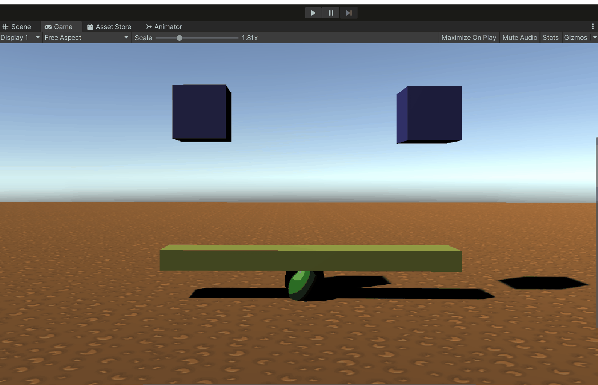

### Is kinematic:

This property indicates that the game object is not affected by physics, so it will not be moved by gravity or any other physical forces. However, the object does affect its surrounding objects by its presence.

I'll tick the `Is Kinematic` checkbox of the right cube and place it lower down so that it touches the plank, and see what happens:

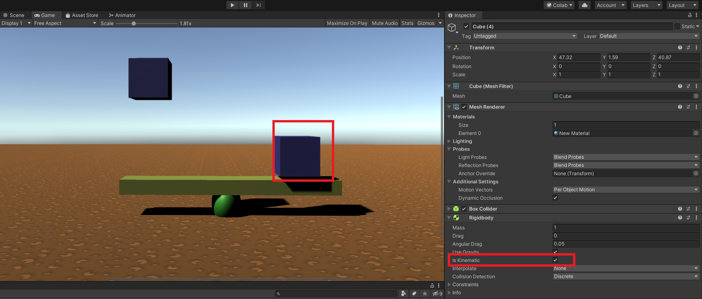

On pressing the _play_ button we see that the cube on the right is not affected by the laws of physics - it doesn't move. However its presence makes the plank behave differently than it would had the cube not had `Is Kinematic` checked:

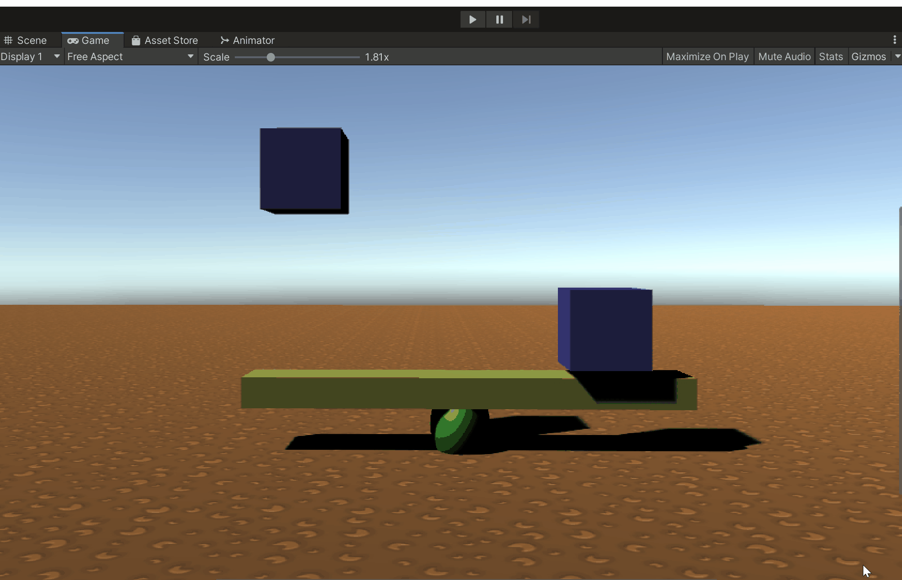

### Interpolate

This is a corrective feature which is used to solve jittery motion. Physics executes at a fixed frame rate and sometimes character movement and graphics do not match, leading to jittery motion.

### Collision detection

This is another corrective feature, used to resolve collision errors which may occur on very fast objects such as bullets. It has three settings:

[comment]: <GM: what does the Discrete setting do? Addresed: added some text>
- **Discrete:** Default setting for rigidbodies. Is much faster than the Continuous and Continuous dynamic modes. This mode is not well suited for very fast movements such as bullets
- **Continuous:** Set on the object that will be hit by or collide with the very fast object
- **Continuous dynamic:** Set on the very fast object (eg bullet)

### Constraints
Constraints are used to control the position and rotation of an object by freezing these properties. We can:

**Freeze position** to enable or disable motion along the X, Y and/or Z axes. To freeze the position of the right cube along the X axis:

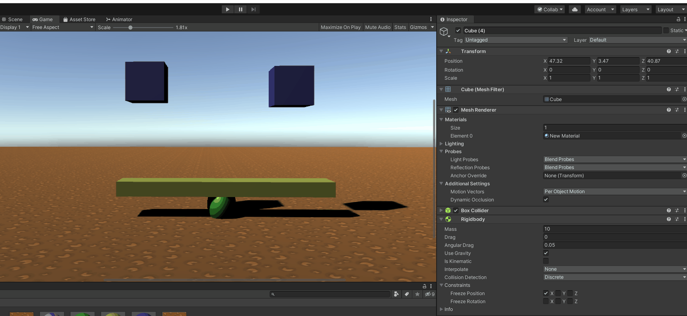

**Freeze rotation** to enable or disable rotation along the X, Y and/or Z axes. We can freeze the rotation of the left cube along the X axis:

Here the left cube has rotation restricted along the X axis. If it did not, this is how it would behave, falling forwards on the X axis:

**Note: Two objects will reach the ground at the same time if they are dropped simultaneously from the same height, no matter their weight.**  This is because both the objects are affected by the same gravitational force.
