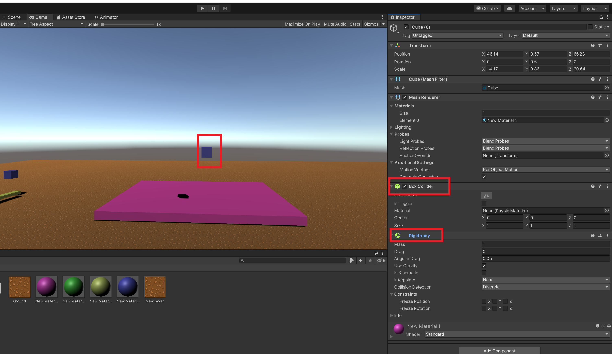
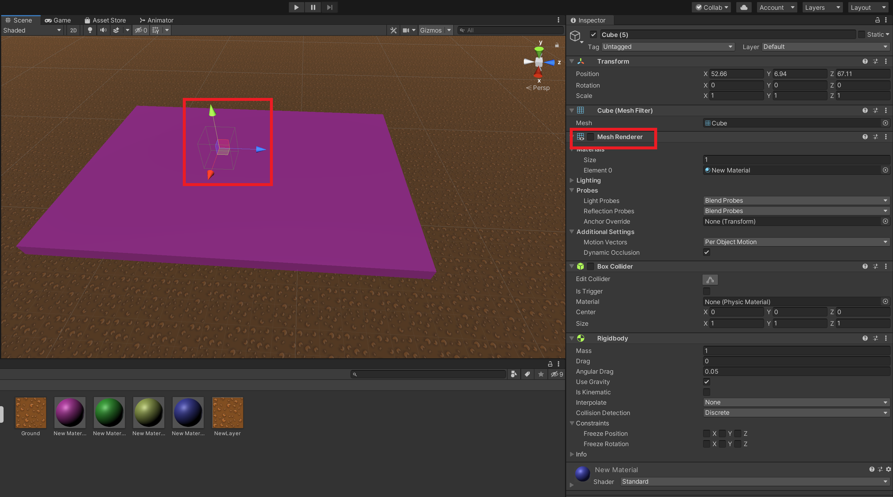
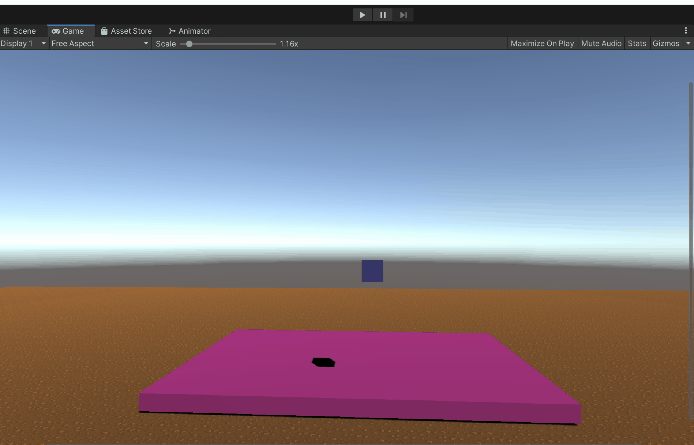
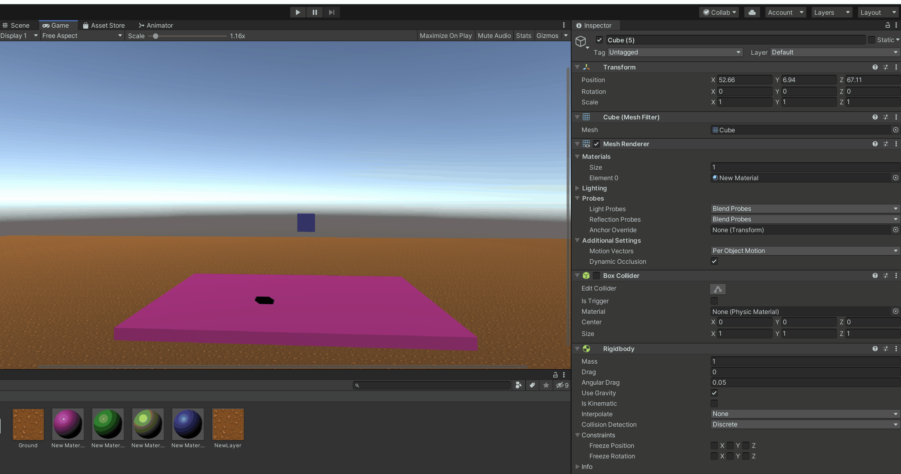
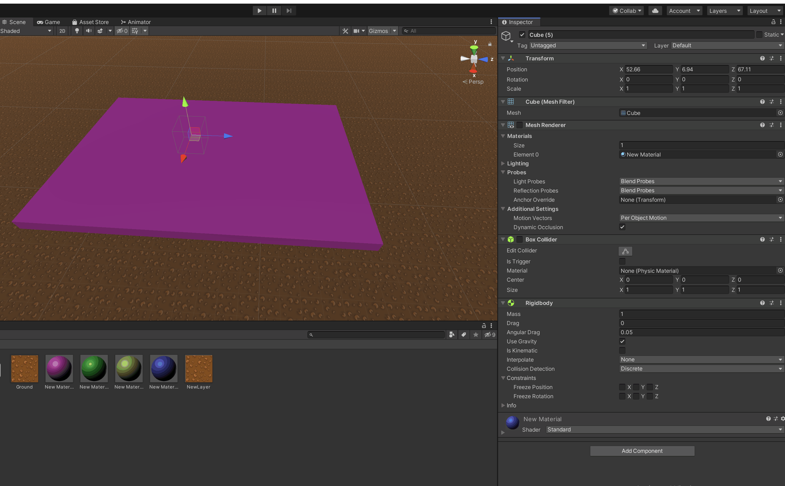
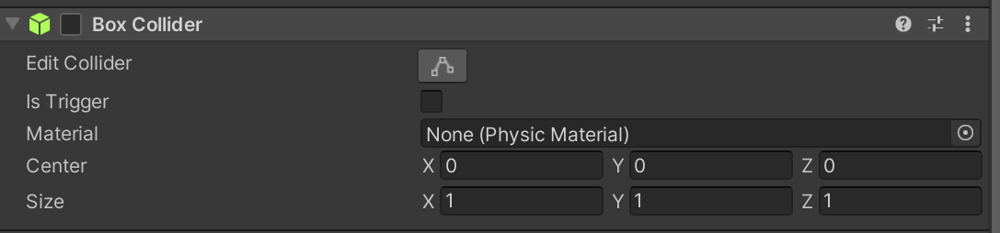
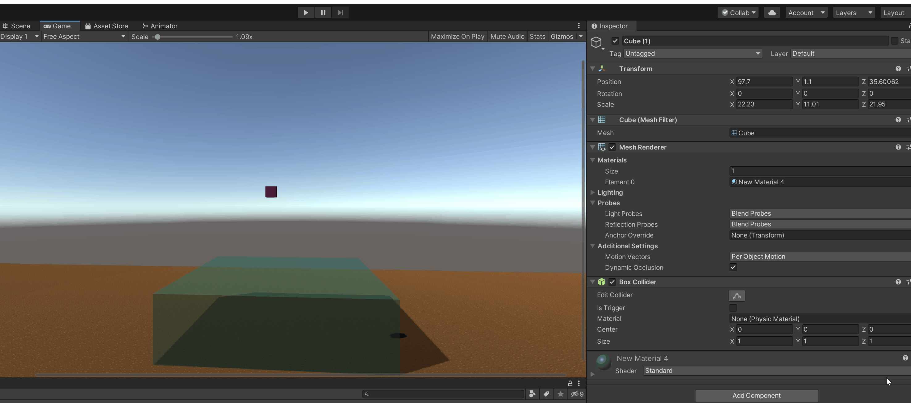
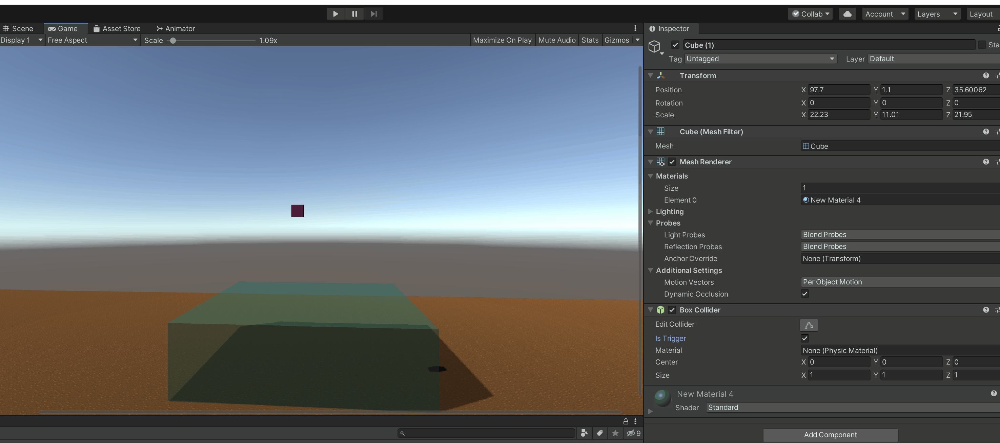

## Colliders in Unity3D

Colliders are invisible shapes on 3D objects that handle collisions. A collider can be added to a GameObject as a component, just like the Rigidbody component. There are six types of 3D colliders:

- Box Collider
- Sphere Collider
- Capsule Collider
- Mesh Collider
- Wheel Collider
- Terrain Collider

[comment]: <GM: are we doing these actions? Can we use the same scene as last time? It's just your plane has changed to pink! Assume this is so you can see what is happening, so could you just explain?>
In this sample scene, we have a 3D Cube and as you can see that it has both `Box Collider` and `Rigidbody` components:

Let's have a look at the invisible `Box Collider` by unchecking the `Mesh Renderer` component. This will show us the shape of the Box Collider on the cube:

Recheck the `Mesh Renderer` component. Let's now look at the default behavior of the 3D Cube during game play:

You can see that the cube does not pass through the pink plane, as the `Box Collider` controls the collision with it.

But what if we disable the `Box Collider`?

Upon disabling the `Box Collider` we see that the cube simply passes through the pink plane. Colliders handle collisions between objects -  the `Box Collider` will decide whether two objects intersect each other or simply pass through.

You can add multiple colliders to a GameObject which can be of the same or different types.

Let's add another `Box Collider` on the cube by going to `Add Component > Box Collider`, and scale it on the X, Y and Z axes.

Let's look at the properties of colliders by taking the `Box Collider` into consideration:

### Box Collider properties:

**Size:** indicates the size of the collider along the X, Y and Z axes.

**Center:** indicates the offset of the collider from the center of an object. 0, 0, 0 will place the collider centrally on the object.

**Material:** determines the physical material of a collider, plastic, metal, wood, glass etc. This is different from the material which controls the look of an object. This material controls the behavior of the collider.

**Edit Collider:** edits the size of the collider.

**Is Trigger:** converts the collider into a trigger. A trigger is a non-solid volume such as a liquid or gas. By default a collider is a solid volume. Nothing can pass through a solid volume, however things can pass through non-solid volumes such as water or gas. Triggers are used to create a space which senses and triggers events when objects enter, stay or leave the space.

Our collider is a solid volume, and as a result the pink cube cannot pass through the blue cube. This is because both are solid objects and both have a `Rigidbody` component. 

Now I'm going to check-mark the `Trigger` box for the large blue cube, which is supposedly water, and see what happens:

You can reset the settings by clicking on the `3 dots icon > and then selecting Reset`

[comment]: <GM: where is the gear icon?>
