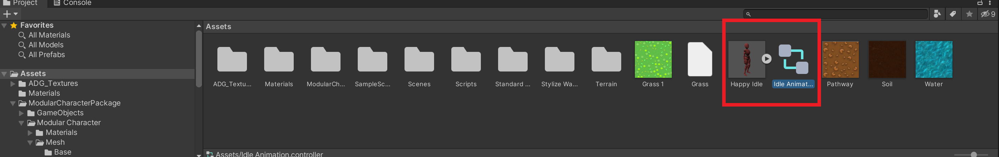
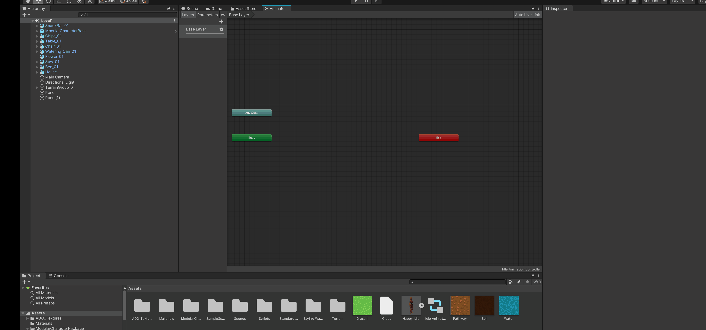
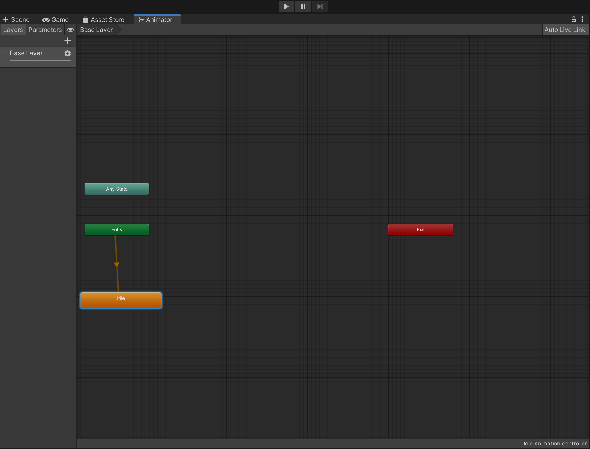
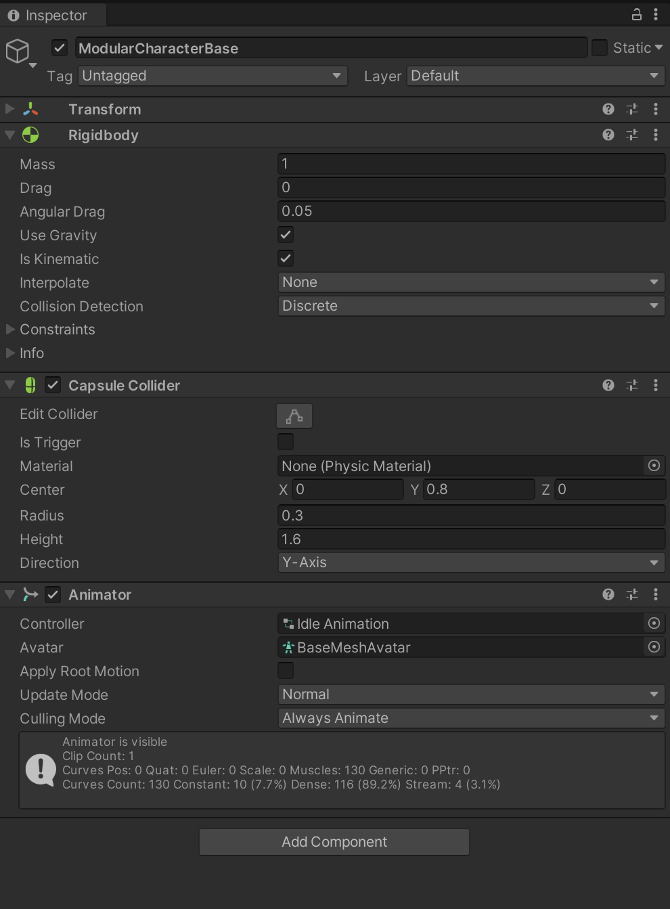

## Third person movement - part-2

### Tidy up

[comment]: <GM: do you mean that any collider components for water objects are unchecked? What collider would we have used for water? Or is it another setting?  Note, this might cause an issue as the character will be walking on the ground so if the pond/water has a collider on it then it will interfere with the character's movement>
We're going to go back to our game world now to look some more at movement. Before anything else, make sure that the collision on any water body such as the pond is unchecked, as we don't want it to interfere with the movement of our character. This might cause an issue as the character will be walking on the ground so if the pond/water has a collider on it then it will interfere with the character's movement

You will often hear terms such as first-person and third-person in gaming.  First-person means that the game world is being seen through the character's eyes. Third-person is a perspective in which the player (ie you) can visibly see the body of the controlled character. The third-person perspective puts you in direct control of a character that you can actually see in front of you.

## Adding an idle animation to your character 

Now let's go ahead and add a starting idle animation to our character. When we press on play, we want our game to start with the character having an animation of some sort. For us this will be idle animation.

1.  Drag and drop the character into the scene view from the _project window:_ `Assets > GameObjects > Modular Character > Prefabs`
    
2.  Now let's go to [https://www.mixamo.com](https://www.mixamo.com) and download an animation for our character.
    
3.  Create an account and log in.
    
4.  In the search bar search for `Happy Idle Variation 2`.
    
5.  You will see a character, doing an animation on loop. Go ahead and click on `Download`.
    

6.  After you have downloaded the animation in `.fbx` format, go to your Unity editor's menu bar: `Assets > Import new Asset > Happy Idle.fbx`.
    
7.  Once imported you should be able to see the file in your `Assets` folder in the _project window_.

[comment]: <GM: could you explain what an animation controller is and does? Addressed: added some text>    

8.  Now let's create a new _animator controller_ by right-clicking in the `Assets` folder in the _project window_ then selecting `Create > Animator Controller`. Rename it `Idle Animation`. An animator controller controls the logic for a characters movement such as when to go from resting to walking state and how fast to walk etc

9.  Your Assets folder should have both the imported `.fbx` animation and `Idle Animation` animator controller:
    

10.  Double-click on the `Idle Animation` animator controller to open the _animator window_. 
    
11.  Drag and drop the `Happy Idle .fbx` file into the _animator window_ and rename it `Idle` in the _animator window_ from the _inspector window_:
    

12.  Now let's apply this animation to our prefab, so that when the game starts the character demonstrates an idle animation.
    
13.  Select `ModularCharacterBase` in the _hierarchy window_ on the left, and in the _inspector window_ check that the `Animator` component is open. If not, add it from `Add Component`.
    
15.  For the `Controller` property select `Idle Animation` (the one we have just been working on).
    
16.  For `Avatar` choose `BaseMeshAvatar`. Make suure that the Update Mode property has its value set to Normal and the Culling Mode property has its value set to Always Animate

[comment]: <GM: the image below shows RigidBody and CapsuleColllider components on the character but I don't think we've added them yet>
[comment]: <GM: you don't say to set the Animator Component properties like Update Mode and CullingMode, or uncheck Root Motion?: Addressed above in line #55>

17. Also add the RigidBody and CapsuleColllider components on the character.  Go ahead and save your work and click on play, and you should see your character in an idle animation!
    
18.  The `Animator` component is used to add an animation to the GameObject in your scene. The value of the `Controller` property is the animation to be used on the character.

[comment]: <GM: the value of the `Avatar` property will be the: Ammended: added missing text ???? >

19.  If the game object is a humanoid which in our case it is, then the value of the `Avatar` property will be the BaseMeshAvatar. Avatar is a way for Unity to find and configure the bones in the model. The definition given by Unity3D is:
    

_The Avatar system is how Unity identifies that a particular animated model is humanoid in layout, and which parts of the model correspond to the legs, arms, head and body._
