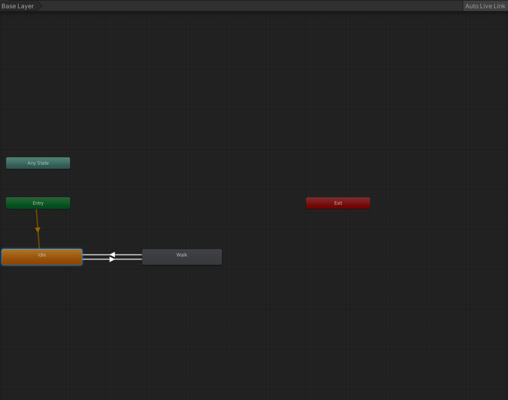
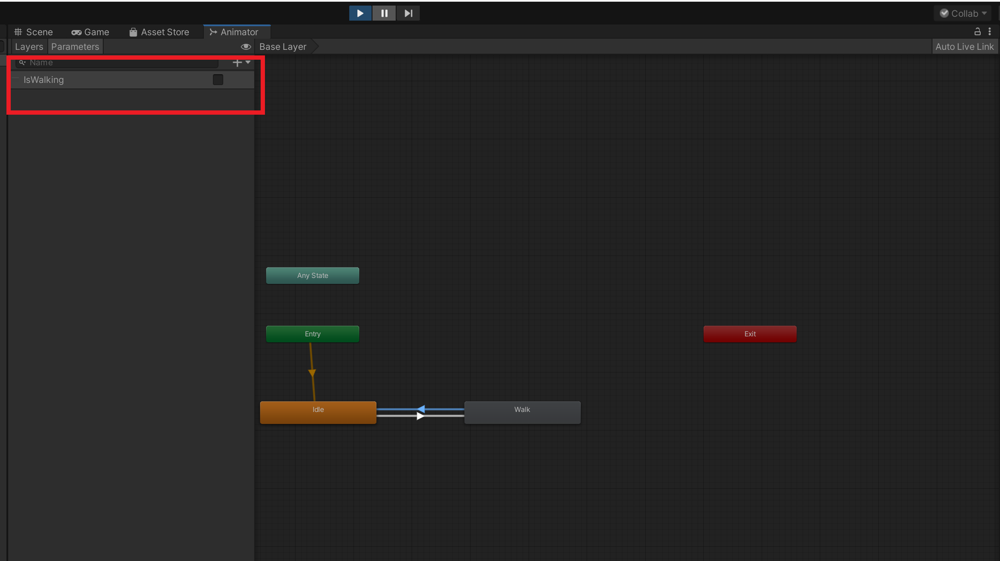
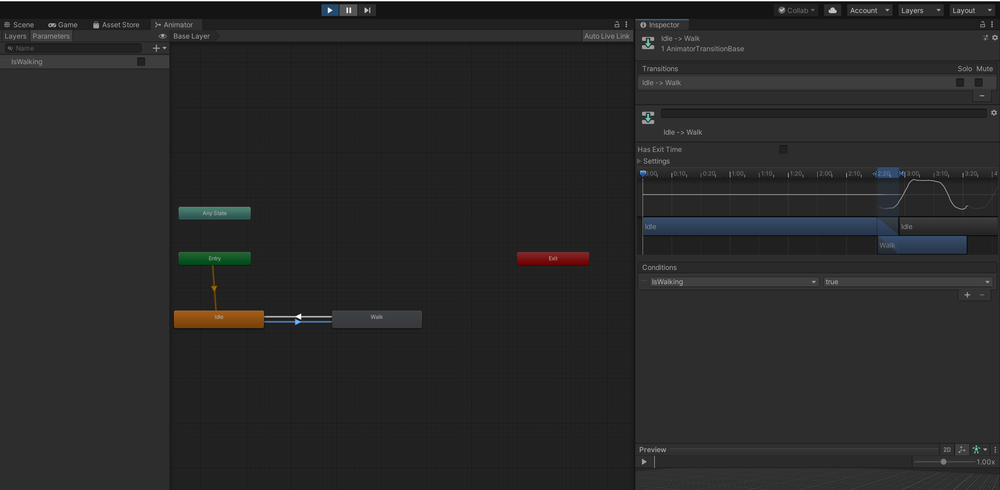
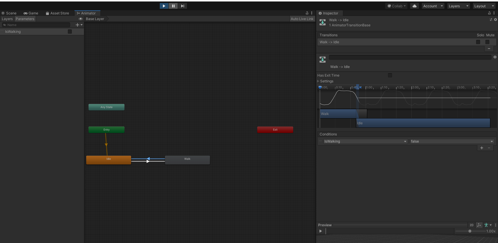
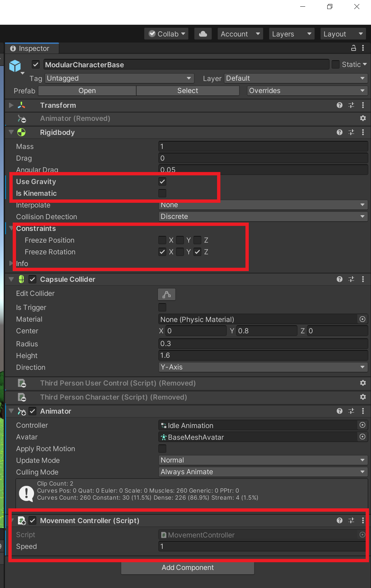

## Third-person movement - part 2

### Rigidbody-based movement

We will be using Rigidbody-based movement for our character to make it move left, right, forward and backward. There are two general ways to implement movement of a character in combination with Unity's physics engine. 
- The first is a *Rigidbody*-based method, in which the character behaves like a regular physics object which you can indirectly control by applying a physical force or changing its velocity. 
- The second method is *Kinematic*-based, in which you directly control the character's movement via the physics engine which will detect collisions.

### Adding Rigidbody-based movement to your character

[comment]: <GM: why are we uploading the character? I got as far as Upload a Character / Select character file and then browsed to animpose.fbx but got an error message about skeleton map: We are  uploading our chaarcter as this is another way of seeing how the animation will look on the character. Can you please try with the Chrome browser>
1.  Go to [](https://www.mixamo.com/)[https://www.mixamo.com](https://www.mixamo.com) and let's upload our character.

2.  Click on `Upload Character > Assets > GameAssets > Modular Character > Poses > animpose.fbx`

3.  Now search for the `Walking` animation in the Mixamo animations page. Clicking on the walking animation, you should be able to see how it'll look on your character. Go ahead and click on `Download` to download the animation.

[comment]: <GM: what does this mean? - Addressed, added an explanation,  also in reply to line #11 if it didnt work for you by uploading the character then you can just download the animation and import it into the game>
_Note: You can also download the walking model as is_ Which means you don't have Upload your game character, apply the walking animation and then download the character with the walkign animation applied to it. 


4.  Once again import the walking animation into your project by going to `Assets > Import New Asset > Walking.fbx`.
    
5.  Now you have two animations in your `Assets` folder in the _project window_ : `Happy Idle` and `Walking`.
    
6.  Click on the `Idle Animation` animator.
    
7.  Go ahead and drag and drop the `Walking` animation into the _animator window_.
    
8.  Connect the existing `Idle` animation to the `Walking` animation by right-clicking on the `Idle` animation and selecting `Make Transition` to make a transition from the Idle to Walk animation.
    
9.  Similarly right-click on the `Walk` animation and make a transition from the `Walking` to `Idle` animation.
    
10.  Re-name the walking animation to `Walk`.



[comment]: <GM: note the name is IsWalking in script and isWalking here - breaks it. I have changed it to IsWalking here: Addressed: Thanks!>

[comment]: <GM: do we tick the box next to the boolean or not? Addressed: no>

11.  Next, whilst still in the `Animator` window, open the `Parameters` tab on the left, and add a boolean parameter by clicking `+ > Bool` and naming it `IsWalking`.
    
12.  We will use out boolean parameter in our script later on.
    



13. Click on the transition from Idle to Walk, and in the _inspector window_, remove the checkmark on `Has Exit Time`. Then under `Conditions` click `+  > IsWalking > true`.



14. Click on the transition from Walk to Idle, and in the _inspector window_, remove the checkmark on `Has Exit Time`. Then under `Conditions` click `+  > IsWalking > false`.



15.  In the `Assets` folder in the _project window_, right-click and select `Create > Folder` and rename it `Scripts`. 
    
16.  In the Script folder, right-click and select `Create > C# Script`. 
    
17.  Name the C# Script `MovementController`.
    
18.  Open the `MovementController` script in VSCode (or whatever code editor you're using).
    
19.  Enter or paste the following code. Each line is commented for you to help you understand the code:
    

```csharp

using System.Collections;
using System.Collections.Generic;
using UnityEngine;

public class MovementController : MonoBehaviour
{
    public float Speed = 5f; //movement speed(meters per second)
    private Rigidbody body; // reference to the Rigidbody component
    private Vector3 inputs = Vector3.zero;//Your input at the very start will be zero. 

    static Animator anim;


    void Start()
    {
        body = GetComponent<Rigidbody>(); // get the Rigidbody component of the character game object
        anim = GetComponent<Animator>();// get the Animator component of the character game object
    }

    void Update()
    {
        inputs = Vector3.zero;// initialize inputs as (0, 0, 0)
        inputs.x = Input.GetAxis("Horizontal"); //Since inputs is a Vector3, the x component will be the A and D keys.
        inputs.z = Input.GetAxis("Vertical");//The z component will likewise be the W and S keys.
        if (inputs != Vector3.zero)  //If Vector 3 is not at 0, 0, 0 l the below code will be run.
        {

            transform.forward = inputs;//The forward direction of the character (the blue arrow) will face towards the magnitude of your inputs.
            anim.SetBool("IsWalking", true);
        }
        else //If you are still
        {
            anim.SetBool("IsWalking", false);//The walking animation will shut down. You will get an idle state
        }

    }


    void FixedUpdate()
    {
        body.MovePosition(body.position + inputs * Speed * Time.fixedDeltaTime);//Fixed updates are always used for rigidbody controllers. Update depends on the frames per second.
        //Fixed update is very consistent across all devices for reliable gameplay.
    }
}


```

20.  Select `ModularCharacterBase` in the _hierarchy window_ and drag and drop the `MovementController` script into the _inspector window_.
    
21.  Make sure that the `Gravity` checkbox is ticked and the `Kinematic` checkbox is unchecked. Kinematic distorts the effect of gravity.
    
22.  Then freeze the rotation around the `x` and `z` on the `Rigidbody`.
    
23.  Also change the `Speed` to `1`.
    
24.  Your _inspector window_ should look like this:
    



25.  `Save` and then click `Play` in the Game View.
    
26.  Use the W,A,S, D or arrow keys to move your character. You can also use the arrow keys.
    


