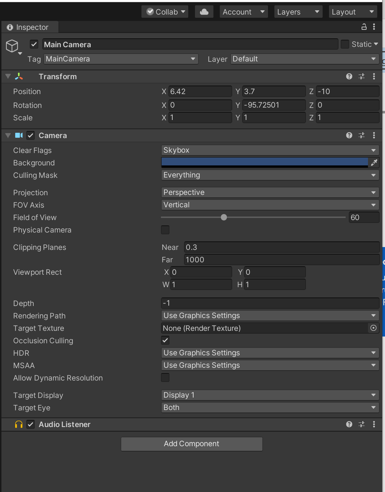

## Third-person camera controller - part 1

You may notice that our camera is static. This means that the camera doesn't move as the character moves. The camera acts as the player's eyes and is considered a GameObject in Unity3D.

A fixed point of view only works when the character is constrained to an area that is completely visible. But usually characters in games can roam about large areas. The typical ways to make this possible is by either using a first-person view or having the camera follow the player's avatar in third-person view mode.

Let's write a script for your camera which will follow our main character as it walks. The camera will also be able to zoom in and zoom out.

But first let's take a look at the components and properties of the camera object in the _inspector window_:

Left-click on the `Main Camera` in the _hierarchy view_. You can see it has a few different components in the _inspector window_. The first one is `Transform`. This has three properties: 

**Position** of the camera object in 3D space

**Rotation** of the camera object in 3D space

**Scale**  - how big the camera object is

*Cameras use position and rotation. Scale gets ignored.*

[comment]: <GM: what should happen with Perspective / Ortho and why? Addressed: added some text>

In the _inspector window_, `Clear Flags` means what gets shown when no object is in view. The default is a `Skybox`. A `Skybox` is just a box with images on all six sides where the player sits in the middle, and no matter where they look they will always see something. We also have some other properties for the camera object such as `Projection`, `Clipping Planes` etc. But we will not change the values of those. 

Go ahead and decrease the `Field of view` to `33` and click on *Play* to see what happens. Also try changing the `Perspective` to `Orthographic`.The perspective camera is how we perceive objects in the real world. We perceive objects to have depth and we can judge how far or close they are to us.  An orthographic camera removes this sense of perspective and objects are displayed without perspective. Orthographic view is commonly used in 2D games whereas perspective view is commonly used in 3D games. 
